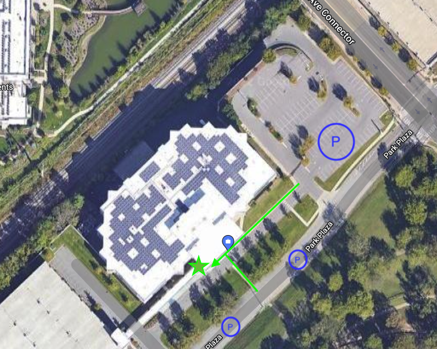

# Getting to your Interview at HCA Healthcare

**Address:** 2555 Park Plaza, Nashville, TN 37203

Google map reference:
<iframe src="https://www.google.com/maps/embed?pb=!1m18!1m12!1m3!1d8720.69025807606!2d-86.8258159733514!3d36.15054124623785!2m3!1f0!2f0!3f0!3m2!1i1024!2i768!4f13.1!3m3!1m2!1s0x886466b398b3eda7%3A0xdf7225216e55986!2sHCA%20Healthcare%20Building%204!5e0!3m2!1sen!2sus!4v1664467972156!5m2!1sen!2sus" width="600" height="450" style="border:0;" allowfullscreen="" loading="lazy" referrerpolicy="no-referrer-when-downgrade"></iframe>

Street view:
<iframe src="https://www.google.com/maps/embed?pb=!4v1664465888189!6m8!1m7!1sgvwTwLI6MG3ddnyxG3cimw!2m2!1d36.14960928160001!2d-86.81832694705867!3f266.5570820668237!4f4.232400225573187!5f0.7820865974627469" width="600" height="450" style="border:0;" allowfullscreen="" loading="lazy" referrerpolicy="no-referrer-when-downgrade"></iframe>

# Parking & Entrance
You should be able to find parking along the street on Park Plaza or in the open lot next to the building. (see the markedup image below.)

Once inside please present to the front desk and let them know you are here for an interview. **Make sure you have a valid ID.**

